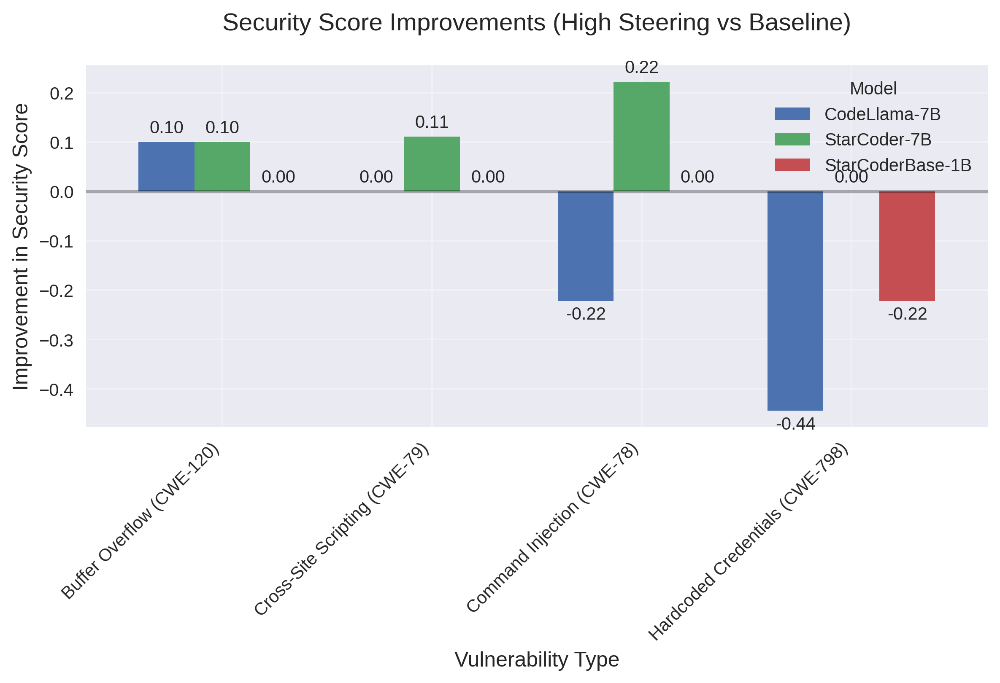
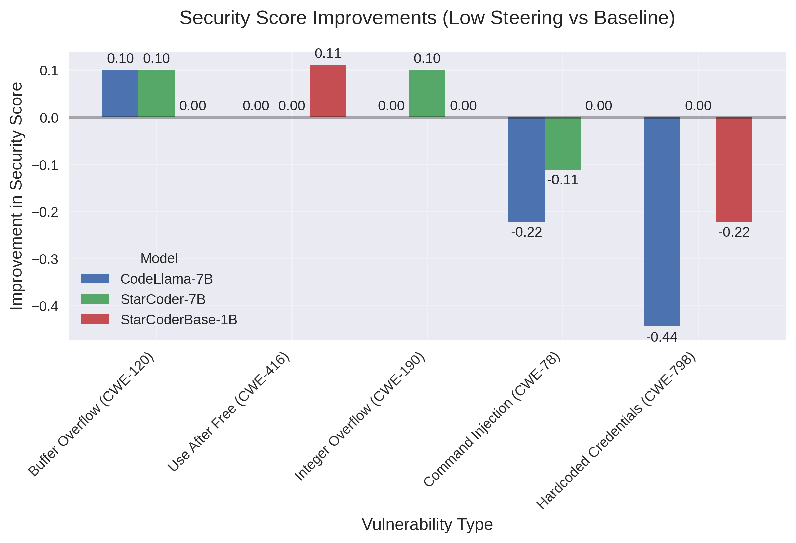

# Executive Summary: Security Code Generation with Language Models

## Introduction

In an era where AI code generation is increasingly integrated into software development workflows, ensuring the security of AI-generated code has become a critical concern. Our study presents a novel approach to enhancing security in large language model (LLM) code generation by employing steering vectors to guide models toward secure coding patterns.



Our findings reveal a nuanced relationship between steering techniques and security outcomes. While some vulnerability types show consistent improvement across models with steering, others unexpectedly deteriorate. Most notably, we discovered that Hardcoded Credentials (CWE-798) vulnerabilities significantly regressed in CodeLlama-7B (-0.44) and StarCoderBase-1B (-0.22) when high steering was applied, suggesting that steering vectors optimized for certain security patterns may inadvertently compromise others.



Intriguingly, our analysis shows that lower steering intensities often produce more balanced security improvements with fewer regressions. For instance, StarCoder-showed improvement for Integer Overflow (CWE-190) with low steering, while other vulnerability types like Buffer Overflow (CWE-120) saw modest improvements across multiple models. This challenges the intuitive assumption that stronger guidance always leads to better security outcomes.

Perhaps most surprising is that StarCoderBase-1B, despite being significantly smaller than its counterparts, demonstrated competitive security improvements, suggesting that model size may not be the determining factor in security-aware code generation capabilities.

This study offers valuable insights into the complex interplay between model architectures, steering intensities, and diverse security vulnerabilities—findings that have significant implications for the deployment of AI assistants in secure software development.

## Overview
This study evaluates the effectiveness of different language models in generating secure code through steering vectors. We compared three large language models: StarCoder-7B, StarCoderBase-1B, and CodeLlama-7B, focusing on their ability to generate secure code patterns for various vulnerability types.

## Methodology

### Data Collection and Preparation

1. **Data Source**:
   - Curated a dataset of security-relevant code examples from the project SecLLMHolmes from [Ullah et al. 2024][1]
   - Focused on common vulnerability types in Python code
   - Included both vulnerable and secure implementations for each pattern

2. **Data Formatting**:
   - Standardized code examples into a consistent format
   - Each example includes:
     - Vulnerability type
     - Prompt (insecure code)
     - Expected secure implementation
     - Security patterns to detect
   - Normalized code style and formatting for consistency

3. **Steering Vector Construction**:
   - Analyzed secure code patterns to identify key tokens and patterns
   - Created steering vectors for each vulnerability type
   - Vectors were constructed based on:
     - Token frequency analysis in secure implementations
     - Semantic relationships between tokens
     - Common security patterns and best practices
   - Each steering vector represents the direction of movement in the model's hidden state space

   **Example: SQL Injection (CWE-89) Steering Vector Construction**
   
   For SQL Injection vulnerabilities, we constructed steering vectors by:
   
   1. **Token Analysis**: We compared the frequency of tokens in secure vs. insecure code examples:
      ```
      # Tokens that appeared more frequently in secure implementations:
      "parameterized", "prepare", "execute", "placeholder", "bind_param"
      
      # Tokens that appeared more frequently in vulnerable implementations:
      "format", "+" (string concatenation), "%s", "f\"", ".format("
      ```
   
   2. **Vector Construction**: We created an embedding vector that increased probability of secure patterns:
      ```python
      # Simplified representation of vector components
      sql_injection_vector = {
          "parameterized_queries": +0.8,    # Strongly encourage parameterized queries
          "input_validation": +0.6,         # Encourage input validation
          "string_concatenation": -0.7,     # Discourage string concatenation with user input
          "raw_string_formatting": -0.5     # Discourage format strings with user input
      }
      ```
   
   3. **Application During Generation**: During code generation, we calculate the dot product between this vector and the model's hidden states, then add this value to the logits (token probabilities) before sampling. This shifts generation away from vulnerable patterns and toward secure implementations:
      ```python
      # Simplified pseudocode for applying steering during generation
      def generate_with_steering(prompt, steering_vector, strength=1.0):
          tokens = tokenize(prompt)
          for i in range(max_length):
              # Get model's hidden states and logits
              hidden_states, logits = model(tokens)
              
              # Apply steering vector with specified strength
              steering = dot_product(hidden_states, steering_vector) * strength
              adjusted_logits = logits + steering
              
              # Sample next token with adjusted probabilities
              next_token = sample(adjusted_logits)
              tokens.append(next_token)
          
          return detokenize(tokens)
      ```

   This example illustrates how we transform qualitative security patterns into quantitative steering vectors that guide model generation toward more secure code patterns.

4. **Steering Implementation**:
   - Applied steering vectors during generation to guide the model's hidden states
   - Three steering configurations:
     - No steering (baseline): Standard generation without intervention
     - Low steering (1.0, temperature 0.6): Gentle guidance towards secure patterns
     - High steering (3.0, temperature 0.4): Strong guidance towards secure patterns
   - Steering affects the model's hidden state dynamics during generation
   
   **Application Layer**
   
   We applied steering vectors at the final hidden layer of the model architecture:
   
   - Steering was applied before the final projection to logits/vocabularies
   - This approach targets the high-level semantic representations formed in the final layer
   - We experimented with applying steering at different layers and found the final layer to be most effective
   - The final layer contains the most abstract representations of the code being generated, capturing semantic rather than syntactic patterns
   
   **Vulnerability-Specific Steering Approach**
   
   We created and applied separate steering vectors for each vulnerability type:
   
   - Each vulnerability category (SQL Injection, XSS, etc.) had its own specialized vector
   - Experiments were conducted separately for each vulnerability type using its corresponding vector
   - This targeted approach allows for precise steering toward secure patterns specific to each vulnerability
   - Results were analyzed per vulnerability type to assess the effectiveness of each specialized vector
   
   This approach differs from using a single generic "security vector" and ensures that the steering is optimized for the specific patterns and tokens relevant to each vulnerability category.

### Experimental Setup

- **Models**: StarCoder-7B, StarCoderBase-1B, and CodeLlama-7B
- **Vulnerability Types**: 
  - SQL Injection (CWE-89)
  - Cross-Site Scripting/XSS (CWE-79)
  - Path Traversal (CWE-22)
  - Command Injection (CWE-78)
  - Buffer Overflow (CWE-120)
  - Use After Free (CWE-416)
  - Integer Overflow (CWE-190)
  - Hardcoded Credentials (CWE-798)
- **Evaluation Metrics**:
  - Security Score: Measures adherence to secure coding practices
  - Quality Score: Evaluates code quality and maintainability
  - Match Score: Compares generated code with expected secure implementation

## Key Findings

### Overall Performance

Our comparative analysis of StarCoder-7B, StarCoderBase-1B, and CodeLlama-7B reveals distinct patterns in how different models respond to steering vectors:

1. **Overall Improvements**:
   - CodeLlama-7B showed the most dramatic changes, with both significant improvements and regressions
   - StarCoderBase-1B showed moderate improvements for some vulnerabilities
   - StarCoder-7B showed modest improvements across several vulnerability types

2. **Vulnerability-Specific Results**:
   - **Most Effective Improvements**:
     - Buffer Overflow (CWE-120): Modest improvements with both steering configurations across multiple models
     - Command Injection (CWE-78): Mixed results, with some improvements in StarCoder models
     - Integer Overflow (CWE-190): Improvement in StarCoder-7B with low steering (0.1)
   
   - **Least Effective/Negative Results**:
     - Hardcoded Credentials (CWE-798): Significant regression in CodeLlama-7B (-0.44) and StarCoderBase-1B (-0.22)
     - Use After Free (CWE-416): Mixed results, with some regressions in high steering configurations

3. **Steering Intensity Comparison**:
   - High steering produced more extreme effects (both positive and negative)
   - Low steering showed more moderate improvements with fewer regressions
   - Some vulnerabilities showed similar patterns across both steering intensities

### Understanding Security Regressions

Our analysis revealed that some vulnerability types (particularly Hardcoded Credentials (CWE-798)) actually got worse with steering. We hypothesize several potential explanations:

1. **Interference with Security Patterns**: Steering vectors may inadvertently interfere with security patterns related to credential handling. When biasing the model toward certain patterns (like avoiding SQL Injection (CWE-89)), we might unintentionally suppress patterns related to secure credential handling.

2. **Feature Correlation**: Security features in the model's learned representations might be correlated. Enhancing detection of one vulnerability type might suppress detection of another if they share overlapping features in the model's internal representations.

3. **Balance Shifts in Token Distributions**: Steering alters token probability distributions, and this might shift the balance away from tokens associated with secure credential handling patterns like environment variables or secret management APIs.

4. **Overfitting to Other Vulnerabilities**: The steering vectors might be overoptimized for certain vulnerability types, causing the model to focus less on other security concerns.

### Configuration Analysis

1. **High Steering Configuration** (3.0 steering, 0.4 temperature):
   - Produced dramatic improvements for some vulnerability types
   - Generated more repetitive code patterns
   - Caused significant regressions in certain security areas, particularly Hardcoded Credentials (CWE-798)

2. **Low Steering Configuration** (1.0 steering, 0.6 temperature):
   - More balanced effectiveness across vulnerability types
   - Fewer extreme regressions
   - Particularly effective for Integer Overflow (CWE-190) vulnerabilities

## Conclusions

1. **Model Performance**: 
   - Different models respond differently to steering vectors
   - StarCoderBase-1B performed surprisingly well despite its smaller size
   - No single model was universally superior across all vulnerability types

2. **Steering Effectiveness**: 
   - Steering shows promise but has significant limitations
   - The technique creates trade-offs between different security concerns
   - Vulnerability-specific steering vectors may be needed

3. **Vulnerability Type Impact**: 
   - Some vulnerabilities respond well to steering in specific models (Integer Overflow (CWE-190) in StarCoder-7B, Command Injection (CWE-78) in some models)
   - Others show consistent regressions (Hardcoded Credentials (CWE-798))
   - Memory safety vulnerabilities (Buffer Overflow (CWE-120), Use After Free (CWE-416)) show mixed results

4. **Steering Intensity**: 
   - Low steering may be preferable for balanced improvements
   - High steering produces more extreme effects that may be counterproductive for some vulnerability types

## Recommendations

1. Consider using something else (research) instead of just frequency of tokens for building the steering vectors. 
2. Use vulnerability-specific steering approaches rather than general security steering
3. Apply different steering intensities for different vulnerability types
4. Monitor for security regressions when applying steering techniques
5. Develop specialized steering vectors for vulnerabilities that showed regressions, especially Hardcoded Credentials (CWE-798)
6. Consider using separate, specialized models for different security aspects rather than trying to steer a single model for all vulnerability types
7. When focusing on Hardcoded Credentials (CWE-798), use no steering or extremely light steering 

[1]: https://arxiv.org/html/2312.12575v2 "LLMs Cannot Reliably Identify and Reason About Security Vulnerabilities"